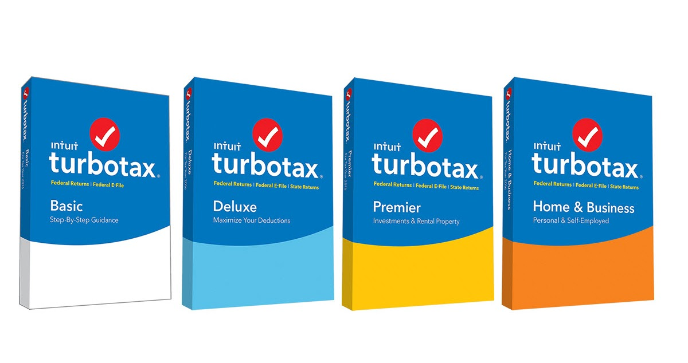

# Turbotax.ca/download

Turbotax.ca/download will help you prepare your Income Tax Return. Thus, it is an effective way of managing your taxes. Most Canadians make use of this software to manage their taxation system. Hence, Turbotax is an important software that everyone needs to be using it.

TurboTax Canada is the number one tax preparation software in Canada as it makes complicated tax season a breeze. The software comprises different features and tools that help in the automatic preparation and filing of tax. It also prompts the necessary updates and notifies the time of tax payment. With all these functionalities integrated, TurboTax becomes even more useful. TurboTax is pretty useful, as it makes the complicated process easy. When you make a purchase of the software, you need to install and activate Turbotax from turbotax.ca/download . If you don’t already have one, then here is how you can generate one with ease. 

## FEATURES OF TURBOTAX.CA/DOWNLOAD

* It has a questionnaire system that allows the users to answer some questions, and the software will decide how you should work it and where you could deduct the tax.

* You can upgrade the system to get one-to-one support from the experts.

* There is no need to fill in your details line by line; you can provide your Employer Identification Number (EIN), which will fill all your details automatically in the system.

* Turbotax.ca/download offers four tiers of products, viz. Basic, Deluxe, Premier, and Self Employed. It is according to the wish of the user to choose any one of them.

## DOWNLOAD TURBOTAX - TURBOTAX.CA/DOWNLOAD 

1. Log in to My Downloads at turbotax.ca/download.
2. Click on the download arrow and select the product you want to install.
3. Save the downloaded setup file to your preferred destination on your computer where you can easily find it.
4. After the download is complete, click on the downloaded file to install your software.
5. During the TurboTax download process with the installation key, you will be asked to enter the 12-digit installation key code.
6. Enter the same and let the installation process be completed.
7. I hope you are now able to successfully generate the TurboTax Installation Key code and activate the program.
8. If for any reason you're still having problems, call the TurboTax support team to get all the help you need.
